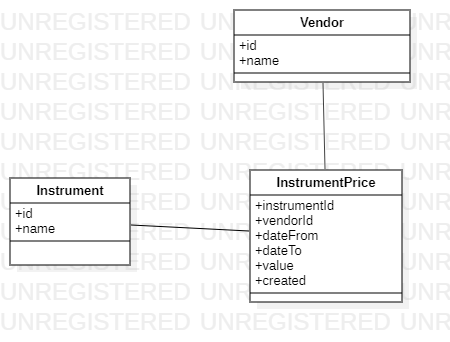
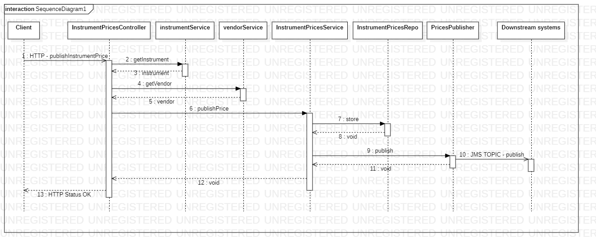

# Spring-boot-jms-topic-app

## Starting application 
To start application please use following command `./mvnw spring-boot:run`

## End to end integration test
End to end integration test is located in file: `InstrumentPricesControllerTestIT`. 

## Class diagram

## Sequence diagram

## Implementation documentation
Implementation information is included in the comments. 